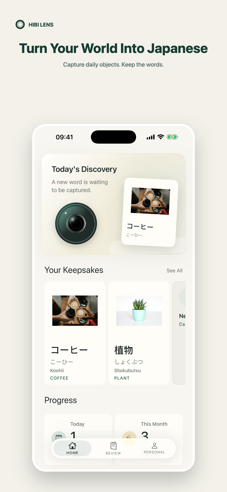
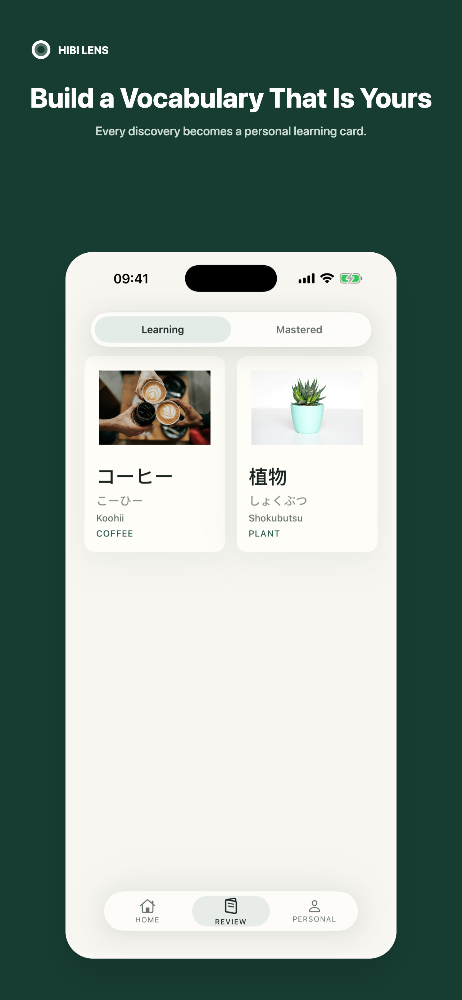

# Hibi Lens

English | [简体中文](README.zh-CN.md)

**See it. Know it in Japanese.**

Hibi Lens is an iPhone app for learning the Japanese names of things around
you. Take a photo or choose one from your library, and the app turns the result
into a vocabulary card you can keep and review.

Recognition runs on the device. Your photos and saved cards stay there too.
Hibi Lens does not require an account.

**Download on the App Store:**
<https://apps.apple.com/us/app/hibi-lens/id6792243095?l=en-US>

<p align="center">
  
  
</p>

## What is included

- Local object recognition with a bundled SigLIP text index
- Japanese terms with kana, romaji, pronunciation, and English meaning
- Saved vocabulary cards with learning and mastered states
- Camera capture and photo-library import
- Light and dark appearance
- English and Simplified Chinese interface text

This repository contains the source for the Hibi Lens 1.0 local client.

## About this repository

This is the official public source release mirror for Hibi Lens. Development
takes place in a private repository; reviewed snapshots are published here at
selected releases.

Issues are open for bug reports, setup problems, and product feedback. Code contributions are not accepted during the soft launch, and Pull Requests are
disabled. See [CONTRIBUTING.md](CONTRIBUTING.md) for the current policy.

## Requirements

- macOS with Xcode 26.5 or later
- An iOS 26 simulator or device
- Python 3 for the model preparation script
- About 200 MB of free space for the Core ML model download and extraction

## Prepare the recognition model

The Core ML image encoder is about 176 MB, so it is distributed as a GitHub
Release asset instead of normal Git history.

From the repository root, run:

```bash
python3 scripts/prepare_siglip_model.py
```

The script downloads the pinned archive, checks its size and SHA-256 digest,
and installs it here:

```text
HibiLens/Models/SigLIP/siglip_base_patch16_224_image.mlpackage
```

The model comes from `google/siglip-base-patch16-224` at revision
`7fd15f0689c79d79e38b1c2e2e2370a7bf2761ed` and is covered by Apache 2.0.

If the download or checksum does not match, the script stops without installing
the archive.

## Build

Open the project after preparing the model:

```bash
open HibiLens.xcodeproj
```

Choose the `HibiLens` scheme and an iOS simulator, then build or run from
Xcode.

To run tests in Xcode, choose `Product > Test` with an iOS simulator selected.

A code-signing-disabled command-line build is also available:

```bash
xcodebuild -project HibiLens.xcodeproj \
  -scheme HibiLens \
  -destination 'generic/platform=iOS Simulator' \
  CODE_SIGNING_ALLOWED=NO \
  CODE_SIGNING_REQUIRED=NO \
  build
```

To redistribute a fork, choose your own product name, Bundle ID, and artwork.
The public project uses a neutral placeholder App Icon.

## How recognition works

Hibi Lens uses a Core ML SigLIP image encoder and a bundled text-embedding
index. The app compares the image embedding with its object vocabulary, then
uses the matching entry to build the Japanese card. Recognition and card
storage stay on the device.

See [docs/recognition-pipeline.md](docs/recognition-pipeline.md) for the file
layout and generation tools.

## Privacy

The local Hibi Lens client does not require an account. Captured images,
vocabulary cards, and study progress are stored on the device. Camera and photo
access are used only when you choose those features.

Read the [Hibi Lens Privacy Policy](https://kiethrios.github.io/PrivacyPolicy/HibiLensPrivacyPolicy_en.html)
for the published policy.

## License and brand

Original source code and tooling released in this mirror are available under
the [MIT License](LICENSE).

That license does not cover every file in the repository:

- The Hibi Lens name, official logo, official App Icon, and designated product
  screenshots are covered by [BRAND_ASSETS.md](BRAND_ASSETS.md).
- JMdict-derived vocabulary material is CC BY-SA 4.0.
- Open Images source material used by the vocabulary pipeline is CC BY 4.0.
- SigLIP and the derived model assets are Apache 2.0.

Attributions and local license copies are listed in
[THIRD_PARTY_NOTICES.md](THIRD_PARTY_NOTICES.md).

## Feedback and security

Use GitHub Issues for reproducible bugs, setup questions, and product feedback.
Please do not post security details in a public Issue. Follow
[SECURITY.md](SECURITY.md) to send a private vulnerability report.
